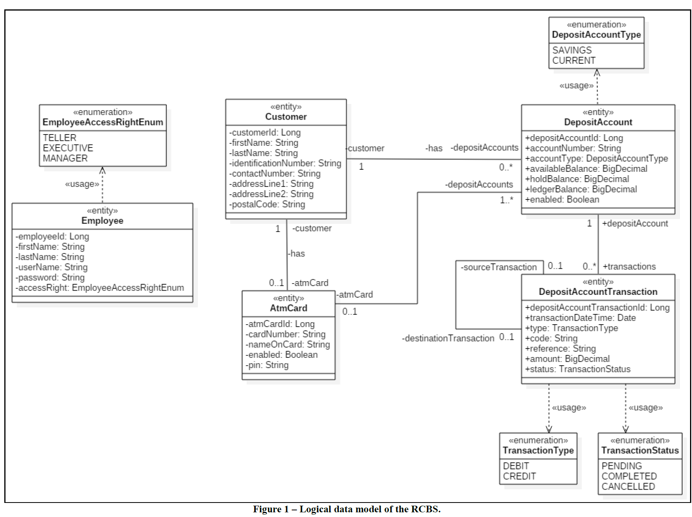

# IS2103 Enterprise Systems Server-Side Design and Development (RCBS)

## About
Merlion Bank is a new retail bank that will be opening in Singapore soon. You have been asked to develop a Retail Core Banking System (RCBS) for Merlion Bank that will consist of i) a core backend to be developed with a component-based architecture; and 
ii) multiple retail banking applications to support the business operation of the bank.

## Logical Data Model

## Use Case
### Teller Terminal
- [X] Create Customer
- [X] Open Deposit Account
- [X] Issue ATM Card
- [X] Issue Replacement ATM Card

### Automated Teller Machine
- [X] Insert ATM Card
- [X] Change Pin
- [X] Enquire Available Balance
